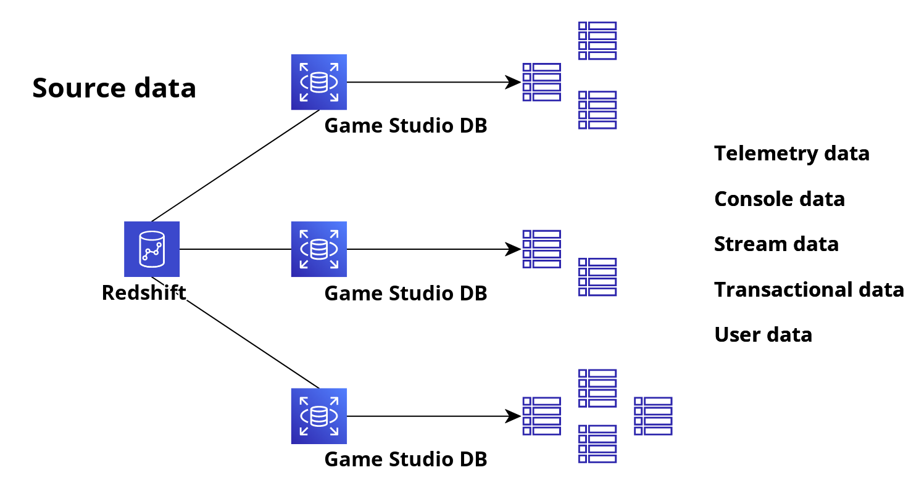
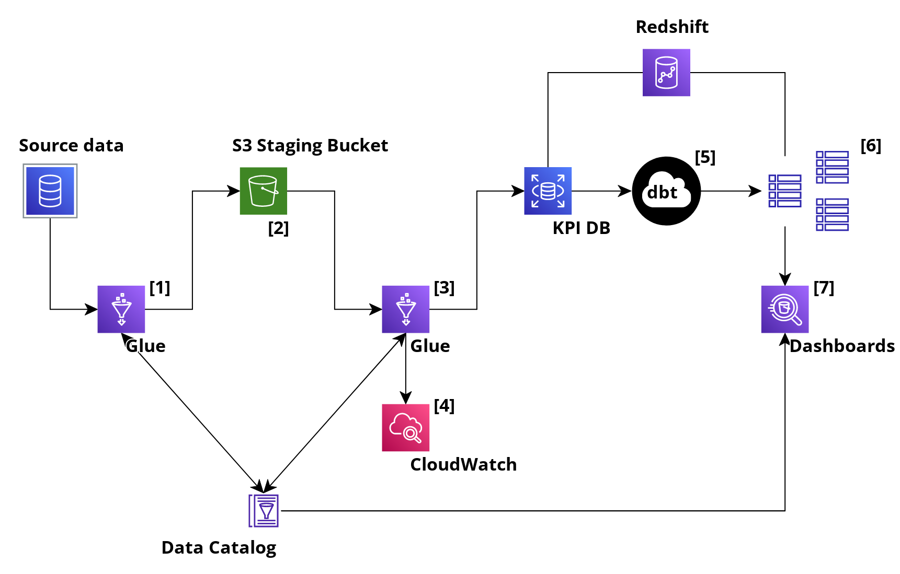

# RFC: Create a set of common KPIs [WIP]

## Authors:
- @sarahknights

## Executive Summary

Create a set of common KPIs across all of PlayStation Studios games based on data from a variety of data sources, including in game telemetry, console platform data, and stream platform data.

## Motivation

Create an efficient way to objectively compare KPIs across the portfolio of games within Playstation Studios to inform future products and key business stakeholders across the business.

## Proposed Implementation

The data currently exists in AWS Redshift, in a raw but valid format. Each game studio has their own database, and each game has it’s own schema with in-game telemetry stored in separate tables according to event type within that schema.

Data will be collected from our raw data sources, loaded and then transformed at the destination. Given we are dealing with high-volume datasets that require frequent loading, an ELT approach is much more efficient as the target KPI database has the processing power to perform the transformations at the analytics stage.

A key concern within this project is the format and structure of the source data. Schemas are highly likely to be very different and a tool is required that is capable of adapting to different configurations and future changes. Additionally, there may be differences in the types of telemetry data that exists between gaming platforms.

Separate AWS Glue pipelines [1] will be initiated to extract game studio, game and telemetry data and load it into tables in a new KPI database sitting within the Redshift data warehouse, using S3 [2] to temporarily stage the data. The initial run will be a full load, with subsequent processes triggering incremental loads to maintain efficiency.

AWS Glue is able to automatically discover the schema of the source tables compensating for likely differences in structure across the different games and game studios.The built-in transformations available in AWS Glue ensure that data ingested into the target database is cleaned and transformed to a standard format in transit [3] without the need for additional processing.

CloudWatch monitors the Glue pipelines that load the data into the KPI database [4], triggering dbt procedures [5] where necessary to normalise and combine the data into centralised tables to ensure all downstream systems have consistent data across all game studios and games [6]. CloudWatch is also able to log and monitor the application.

Utilising the Glue Data Catalog, data lineage can be preserved and metadata stored. This can then inform the dashboard output, for example Amazon Athena [7].

## Metrics and Dashboards

Performance metrics to be implemented to ensure downstream dashboards and reporting outputs are accessible and available. There should be consideration to snapshot datasets should latency occur.

Monitoring with CloudWatch against the AWS Glue pipelines will identify job failures, latency and resource consumption at a granular level.

## Drawbacks

Ensure that relevant source data already exists across all games, across all genres and is platform-independent. Validate the reporting KPI outputs with the key business stakeholders to ensure the provision of the implementation aligns with the business need.

## Alternatives

This proposal promotes the use of products from within the AWS ecosystem, primarily because of ease of integration and security. However, there are many other 3rd party options available. There are also other services provided by AWS, such as Kinesis which could be considered.

Consideration should also be made as to whether an ETL or ELT approach should be taken. This proposal focuses on an ELT strategy based on the assumed quantity and quality of data to be ingested.

## Potential Impact and Dependencies

### Impact
- Future modification to source schemas may need to be reviewed to ensure ongoing successful integration
- Persistent access to source schemas will need to be provided and maintained
### Dependencies
- The data is already available in AWS Redshift
- There is a single AWS Redshift cluster containing all game studio databases
- All game studio database types are supported by AWS Glue
- All game data to be ingested requires user sign in to either SEN or PSN

## Unresolved Questions

- Should we incrementally load data in batches or stream continual changes through the pipeline?
- How are the reporting KPIs generated? Is that out of scope for this RFC?

## Conclusion

Collating data from disparate systems into a centralised structure is likely to have additional benefits than just those defined in this user story. Utilising an approach which allows scalability and extensibility ensures building a tool that is future-proofed and that can provide the bedrock for similar projects and requests.
